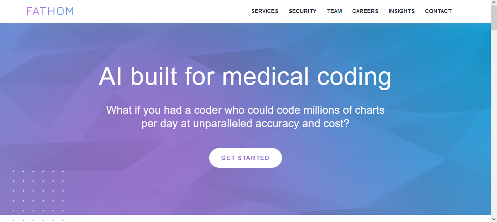

# Fathom-Health

## Overview

This project is a clone of the [Fathom Health](https://fathomhealth.com/) website, built using React and Chakra UI. The goal of the project was to replicate the layout and design of the original website to showcase frontend development skills.

The project is deployed on Vercel and can be accessed [here](https://fathom-health.vercel.app/).

## Features

- **Responsive Design**: The website is designed to be responsive, adapting to various screen sizes, including mobile devices and tablets.

- **Navigation**: The navbar includes a logo, navigation links, and a mobile menu for smaller screens.

- **Page Highlighting**: Active pages are visually highlighted in the navbar to provide a seamless browsing experience.

## Technologies Used

- React
- Chakra UI
- React Router
- Vercel (for deployment)